# Layout examples

Single documented repo of layout approaches. Each section names an algorithm or strategy, explains what it does, and shows the rendered output as an inline image. The SVG files live next to this doc under `examples/` — they are referenced, not duplicated.

Regenerate with `pnpm --filter @filigree/alg-layered generate-docs`.

<!-- Generated file — do not edit by hand. -->

## Index

- [Layered (default)](#layered-default)
- [Layered with BalancedNodePlacer](#layered-balanced)
- [Layered with LinearNodePlacer](#layered-linear)
- [Layered on a cyclic graph](#layered-cyclic)
- [Layered with a compound node](#layered-compound)
- [Parallel edges (bidirectional pair)](#layered-bidirectional)
- [Compound with custom padding (elk.padding = 4)](#layered-compound-tight)
- [Flowchart with label backgrounds](#layered-themed)
- [Render polish — corner radius, dashed edges, per-element theming](#layered-styled)
- [Mr.Tree (tree layout)](#mrtree-project)
- [Radial (concentric tree)](#radial-architecture)
- [Force-directed](#force-organic)
- [Layered + human hint (pin position)](#layered-pinned)
- [Layered + human hint (same layer)](#layered-same-layer)
- [Layered + human hint (order before)](#layered-order-before)
- [Layered + human hint (group)](#layered-group)
- [Layered + hyperedges (multi-source / multi-target)](#layered-hyperedge)
- [Rectpacking (shelf packing)](#rectpacking-cards)
- [Stress (majorization)](#stress-mesh)

## Layered (default)

Classic top-to-bottom flowchart. Default composition: greedy cycle breaker, longest-path layer assignment, barycenter crossing minimization, Brandes-Köpf node placement, two-bend orthogonal edge routing.

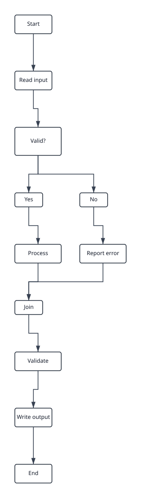

## Layered with BalancedNodePlacer

Same flowchart, simpler placer: linear initial placement then a single-pass median balance.

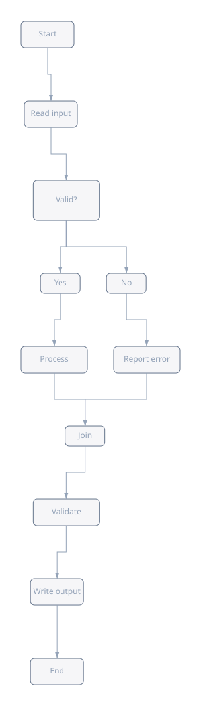

## Layered with LinearNodePlacer

Simplest placer — every node at its `indexInLayer * spacing`. Reveals what a pre-balancing layout looks like.

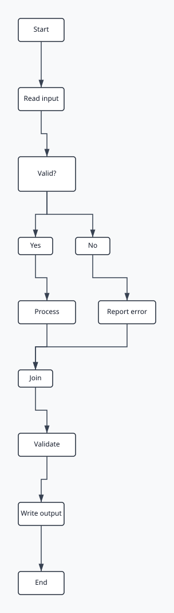

## Layered on a cyclic graph

Demonstrates the greedy cycle breaker. The back edge (fix → check) is reversed for layering so longest-path treats the graph as a DAG.

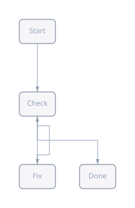

## Layered with a compound node

Hierarchical layout. The engine recurses bottom-up: the sub-flow is laid out first, the compound is sized from its children, then the top level lays out preamble → sub-flow → finale.

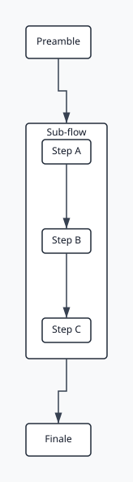

## Parallel edges (bidirectional pair)

Two edges between the same node pair. The router groups parallel edges, leaves one along the natural column, and detours the other through a side offset (LayeredOptions.parallelEdgeOffset). Without the offset both lines would trace the same vertical column.

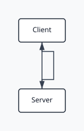

## Compound with custom padding (elk.padding = 4)

Same compound topology as above but the root sets `elk.padding: 4`. Inheritance walks the parent chain in DefaultOptionResolver, so the sub-flow compound picks up the tighter padding without an explicit override.

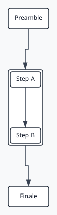

## Flowchart with label backgrounds

Same flowchart, rendered with `labelBackground: "#fef3c7"`. The renderer emits a backing rect behind every label so wider text remains readable over busy edges or narrow nodes.

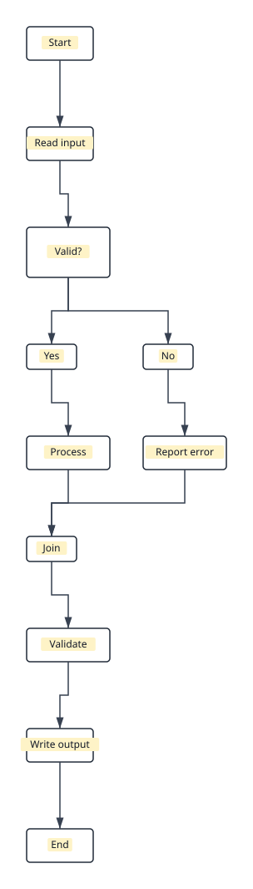

## Render polish — corner radius, dashed edges, per-element theming

Same flowchart, rendered with `nodeCornerRadius: 10` plus per-element `nodeStyle` / `edgeStyle` callbacks. The `decision` node draws in a warning palette, the `end` node in a success palette, and any edge whose target id starts with `no_` or `process_no` draws dashed to visually mark the error branch. The base style still applies to nodes/edges the callbacks don't touch.

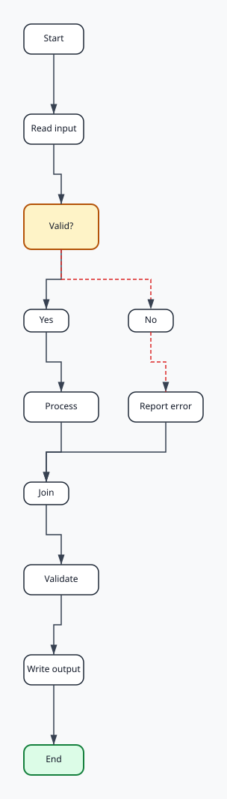

## Mr.Tree (tree layout)

Reingold-Tilford-style tree placement. Leaves are placed left-to-right, internal nodes are centred above their direct children, levels stack vertically. Reads edges as parent → child; nodes with no incoming edge are treated as roots.

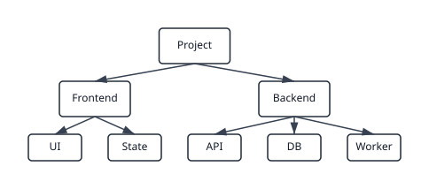

## Radial (concentric tree)

A hub-and-spoke architecture diagram. The root sits at the centre; each subsequent level lives on a circle of increasing radius. Children of a node share their parent's angular slice.

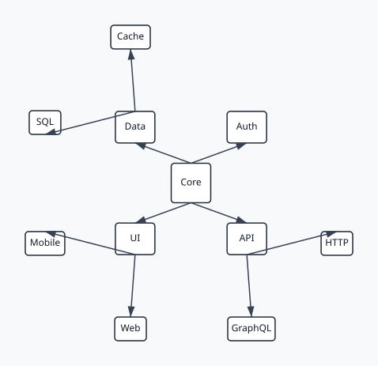

## Force-directed

Fruchterman-Reingold. Deterministic spiral start, 100 iterations with cooling. Connected nodes converge to roughly equal spring lengths; the graph forms two triangles linked by one edge.

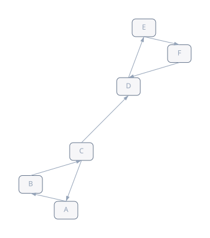

## Layered + human hint (pin position)

The 12-node flowchart laid out with the default layered pipeline, then post-processed by `applyHints`. A `pinPosition` hint locks `decision` at a custom coordinate. The rest of the graph keeps its algorithm-computed placement; only the pinned node moves. Edges already routed through the pinned node aren't re-routed — a deliberate known artefact for this first hint POC.

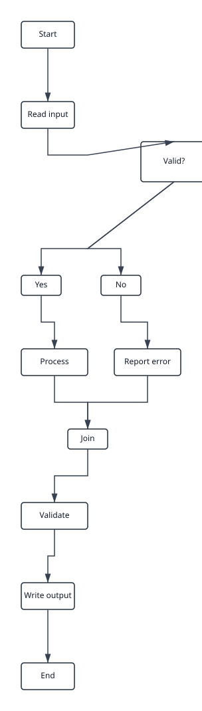

## Layered + human hint (same layer)

Two branches of unequal length share a root. Longest-path places `left_leaf` one layer above `right_leaf`, leaving the two terminations on different rows. A `sameLayer(left_leaf, right_leaf)` hint asks `HintAwareLayerer` to push both leaves to `max(layer)` so they line up at the bottom. The layer partition is rebuilt after longest-path; downstream crossing minimization keeps the columns sensible.

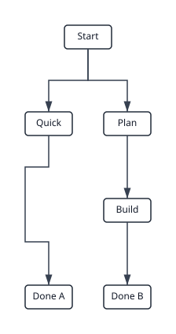

## Layered + human hint (order before)

Same flowchart. A `orderBefore('no_branch', 'yes_branch')` hint flips the two `decision` children so 'No' shows up on the left. `HintAwareCrossingMinimizer` wraps barycenter; the swap happens after the barycenter sweep, overriding whichever order minimization picked.

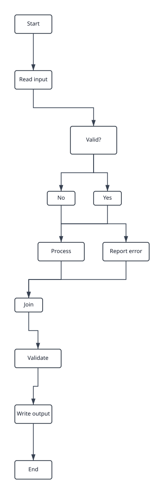

## Layered + human hint (group)

A five-task fan-out / fan-in pipeline. A `group(['task_a', 'task_c', 'task_e'])` hint clusters the three odd-named tasks together in their layer — `HintAwareCrossingMinimizer` re-packs the layer after barycenter so group members occupy a contiguous run starting at the leftmost member's slot. Useful for keeping related siblings together when the algorithm has no other reason to favor that arrangement.

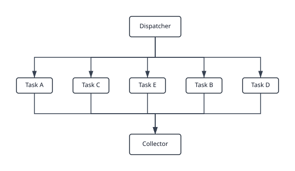

## Layered + hyperedges (multi-source / multi-target)

Three producers fan into one merge step via a single hyperedge (`sources: ['producer_a', 'producer_b', 'producer_c']`), and the merge fans out to two consumers via another hyperedge. The orthogonal router emits one route segment per branch — every branch meets at a shared junction point on the y-midline between the source and target layers. Simple one-to-one edges still use the classic two-bend route.

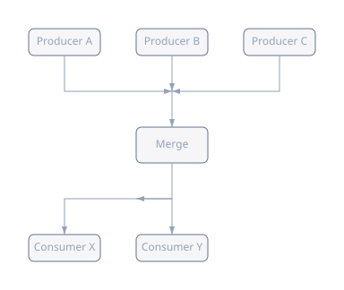

## Rectpacking (shelf packing)

Twelve cards of varied sizes packed into a compact rectangle. Edges are ignored — rectpacking only positions rectangles. Sort by descending area, then place each card on the current shelf if it fits within the target width (derived from `sqrt(totalArea × aspectRatio)`), otherwise start a new shelf below.

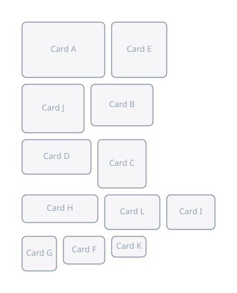

## Stress (majorization)

A small mesh of seven nodes laid out by stress majorization. Each iteration shifts every node toward a position that minimizes Σ wᵢⱼ(‖xᵢ−xⱼ‖−dᵢⱼ)², where dᵢⱼ is the graph-theoretic distance scaled by `desiredEdgeLength` and wᵢⱼ = 1/dᵢⱼ². Adjacent nodes end up close, multi-hop nodes spread out proportionally.

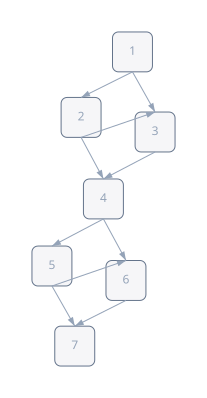
